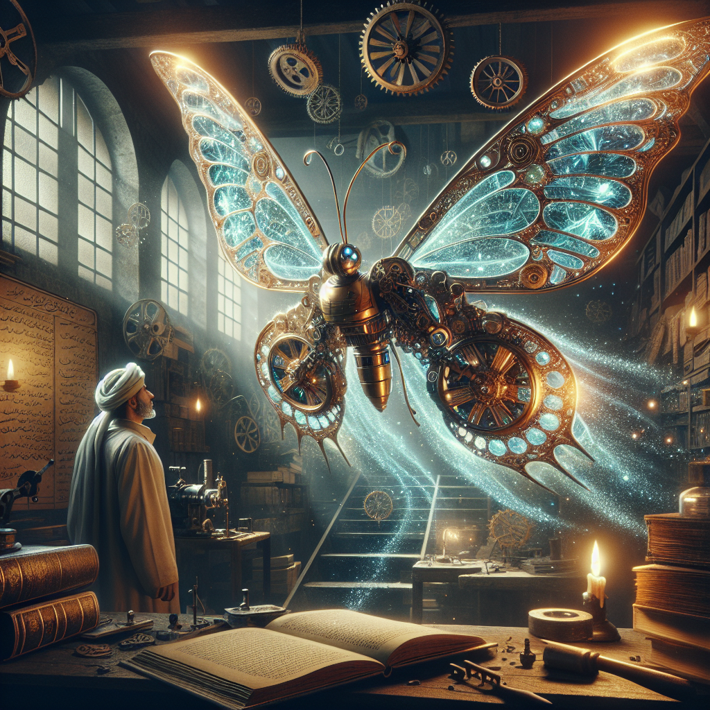
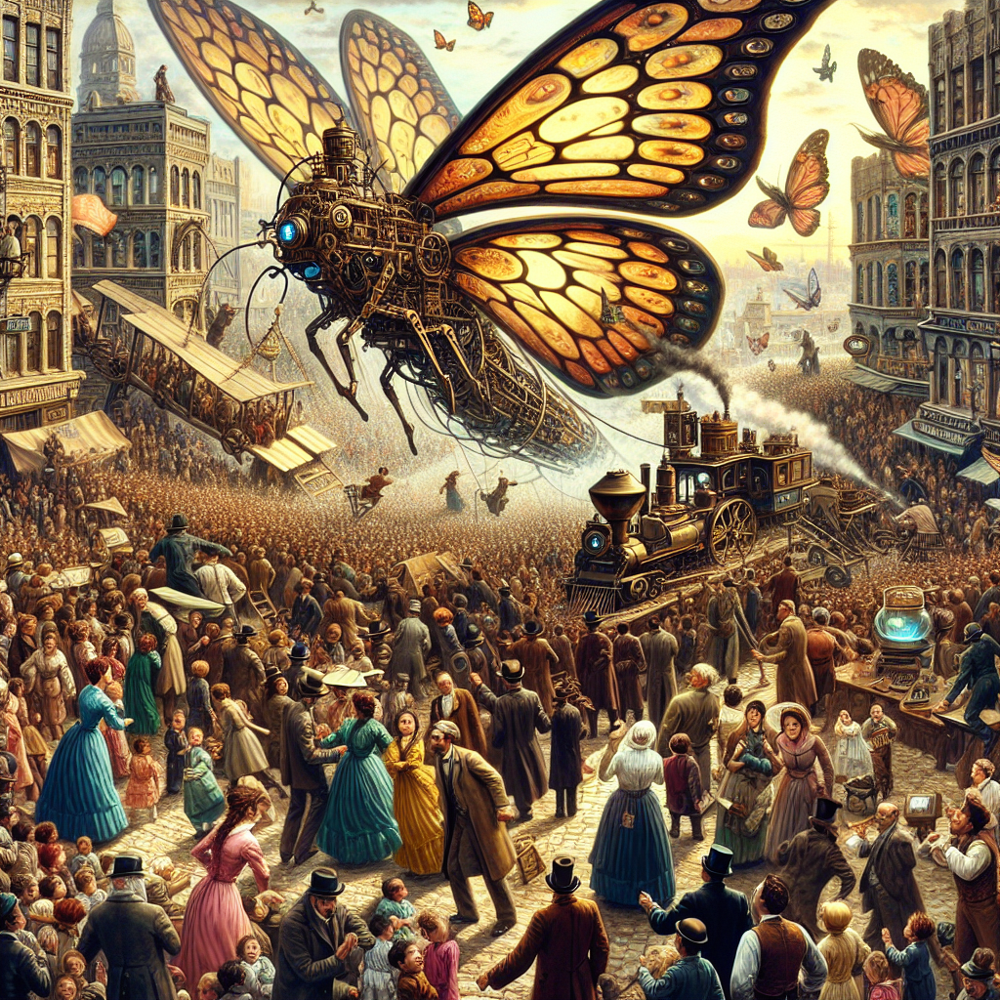
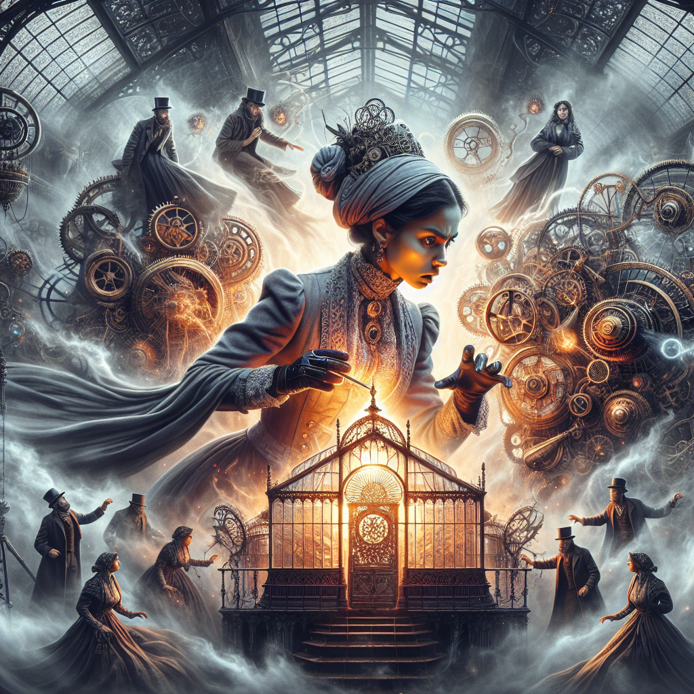
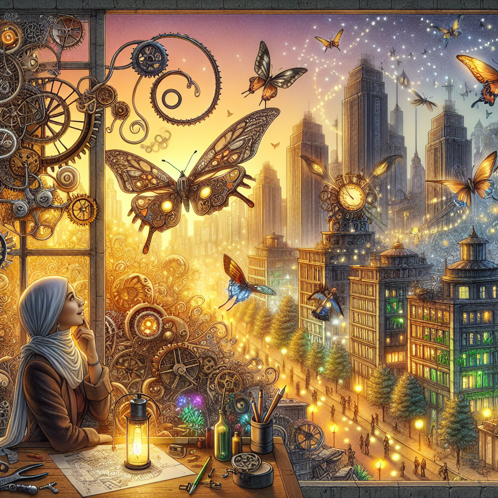

# The Tale of the Mechanical Butterfly - Key Scenes

## Scene 3

In a dimly lit, expansive workshop filled with the scent of old parchment and the quiet ticking of countless gears, an air of mysticism permeates the space. Shadows from flickering candlelight dance across towering bookshelves laden with tomes and scrolls, hinting at ancient knowledge and time-honored secrets. The room's atmosphere is one of focused creativity, a blend of enchantment and wonder.

## Scene 6

In the heart of a bustling Victorian city, a fantastical spectacle unfolded. The streets were alive with color and movement, as tightly packed crowds of men, women, and children in period garb craned their necks toward the sky, eyes wide with a mix of wonder and trepidation. Their clothes, rich with hues of teal, mustard, and burgundy, swirled together as they pointed and whispered excitedly to one another, their expressions a tapestry of fascination and disbelief.

---

## Scene 9

In the heart of a massive, ethereal city covered by a wrought-iron dome, a fantastical scene unfolds, bathed in an otherworldly glow. The air vibrates with the whispers of steam and the rhythmic ticking of countless gears. Shadowy figures adorned in elegant Victorian attire float within the mist, their eyes wide with wonder and apprehension. These silent witnesses orbit around a central figure, a woman with a commanding presence, her gaze intense with concentration and power.

---

## Scene 12

In the heart of a vibrant steampunk metropolis, the scene unfolds like a tapestry of imagination and wonder. The air is alive with the intricate dance of giant clockwork butterflies, their metallic wings shimmering under the last rays of a golden sunset. These mechanical marvels glide effortlessly above a sprawling cityscape, where towering skyscrapers whisper secrets of a bygone era filled with gears and steam-powered dreams.

---

